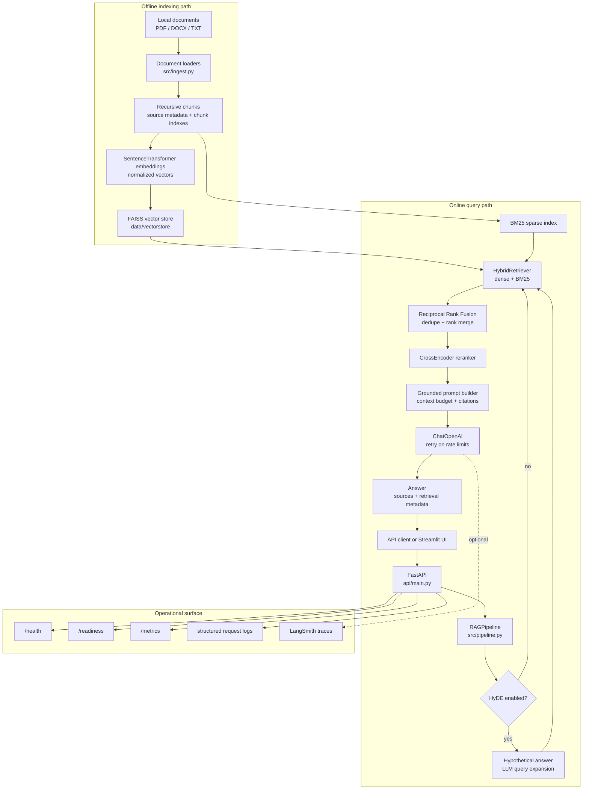

# Document Q&A RAG System

Production-style Retrieval-Augmented Generation (RAG) system for question answering over local documents. The project is built as a senior AI engineering portfolio piece with hybrid retrieval, cross-encoder reranking, optional HyDE query expansion, deterministic tests, RAGAS quality gates, FastAPI serving, Streamlit UI, Prometheus metrics, and optional LangSmith tracing.

The committed sample corpus contains three NIST PDFs:

- NIST AI Risk Management Framework
- NIST Generative AI Profile
- NIST Zero Trust Architecture

## Demo

Demo video location: `docs/assets/demo.mp4`

Add the recorded walkthrough at that path before publishing the repository. The demo should show the full local workflow: ingesting the sample NIST documents, starting the FastAPI service, checking readiness, asking a grounded question through the API or Streamlit UI, and inspecting returned source citations.

## Architecture

This repository separates the RAG system into explicit layers so each concern can be tested, replaced, and explained independently:

- **Ingestion layer** loads PDFs, DOCX files, and text files, then creates citation-friendly chunks with source metadata.
- **Indexing layer** builds a local FAISS vector store from normalized SentenceTransformer embeddings.
- **Retrieval layer** combines dense vector search with BM25 keyword search, then fuses ranked results with Reciprocal Rank Fusion.
- **Reranking layer** applies a CrossEncoder to the retrieved candidate set before prompt construction.
- **Generation layer** builds a grounded prompt, calls the chat model with retry handling, and extracts source citations.
- **Serving layer** exposes the pipeline through FastAPI endpoints, readiness checks, structured request logs, metrics, and a Streamlit chat UI.



### Runtime Request Flow

1. A user submits a question through `POST /query` or the Streamlit chat UI.
2. FastAPI validates the request with Pydantic and sends synchronous RAG work to a worker thread so the event loop is not blocked.
3. `RAGPipeline` optionally expands the query with HyDE when enabled.
4. `HybridRetriever` retrieves candidates from both FAISS and BM25, merges them with Reciprocal Rank Fusion, and removes duplicates.
5. The CrossEncoder reranker scores query-document pairs and keeps the highest-quality context chunks.
6. The generator formats a grounded prompt with source labels and calls the configured OpenAI chat model with retry handling.
7. The response returns the answer, cited source filenames, the number of chunks retrieved, and retrieval metadata.

### Component Map

| Layer | Main files | Responsibility |
| --- | --- | --- |
| Configuration | `src/config.py` | Pydantic settings, validation, model paths, retrieval weights, feature flags |
| Exceptions and utilities | `src/exceptions.py`, `src/utils.py` | Typed failure modes, structured logging, safe text truncation, latency timers |
| Ingestion | `src/ingest.py`, `scripts/run_ingest.py` | Document loading, metadata enrichment, recursive chunking, vectorstore build command |
| Embeddings and index | `src/embedder.py` | Cached embedding model creation, FAISS build/load, vectorstore error handling |
| Retrieval | `src/retriever.py` | Dense retrieval, BM25 retrieval, RRF fusion, HyDE query expansion support |
| Reranking | `src/reranker.py` | CrossEncoder scoring with graceful fallback on model failure |
| Generation | `src/generator.py` | Context formatting, prompt construction, LLM retry policy, citation extraction |
| Orchestration | `src/pipeline.py` | End-to-end query workflow, readiness state, input validation |
| API | `api/main.py`, `api/schemas.py`, `api/middleware.py`, `api/observability.py` | HTTP contracts, lifecycle loading, rate limits, request logs, metrics |
| UI | `app/streamlit_app.py` | Chat interface, API health status, top-k and HyDE controls, source display |
| Evaluation | `eval/rag_eval.py`, `tests/eval/test_rag_quality.py` | RAGAS dataset execution and slow quality gates |

### Architecture Decisions

| Decision | Reason |
| --- | --- |
| Local FAISS vector store | Keeps the project easy to run locally while still demonstrating vector search design. |
| Hybrid retrieval | Dense search handles semantic similarity; BM25 preserves exact terms, acronyms, and framework names common in technical documents. |
| Reciprocal Rank Fusion | Merges dense and sparse rankings without depending on incompatible raw score scales. |
| Retrieve wide, rerank narrow | Fast retrievers collect candidates; the CrossEncoder spends compute only on the smaller candidate set used for generation. |
| Grounded prompt with source metadata | Makes citations traceable to original files and chunk positions. |
| Separate liveness and readiness | `/health` confirms the process is alive; `/readiness` confirms the vectorstore-backed pipeline can accept traffic. |
| Slow eval tests | Keeps default CI deterministic and free of paid calls while preserving an on-demand RAG quality gate. |

## Tech Stack

| Area | Technology | Why |
| --- | --- | --- |
| API | FastAPI, Pydantic | Typed request/response contracts, validation at the boundary, async endpoint wrappers around sync RAG work |
| UI | Streamlit | Fast interactive chat UI with health checks, source expanders, top-k control, and HyDE toggle |
| Loading | LangChain community loaders, PyMuPDF, docx2txt | Practical support for PDF, DOCX, and TXT documents |
| Chunking | RecursiveCharacterTextSplitter | Stable chunks with configurable size/overlap and source metadata for citations |
| Dense retrieval | SentenceTransformers + FAISS | Local embeddings and exact vector search suitable for the small committed corpus |
| Sparse retrieval | rank-bm25 | Captures exact terms and acronyms that dense retrieval can miss |
| Fusion | Reciprocal Rank Fusion | Combines dense and sparse ranks without calibrating incompatible score scales |
| Reranking | sentence-transformers CrossEncoder | Improves final context ordering by scoring query/document pairs jointly |
| Generation | ChatOpenAI + tenacity | Grounded answer generation with retry handling for rate-limit failures |
| Evaluation | RAGAS, pytest slow tests | On-demand quality gates for faithfulness, answer relevancy, context precision, and recall |
| Observability | Prometheus, loguru, LangSmith | Metrics, structured request logs, and optional LLM tracing |
| Quality | pytest, ruff, mypy, GitHub Actions | Deterministic tests, linting, formatting, type checks, security and repo hygiene checks |

## Setup

Prerequisites:

- Python 3.11
- `make`
- OpenAI API key for generation, HyDE, and real RAGAS evaluation

Install dependencies:

```bash
make setup
```

Create a local environment file from the example and set secrets locally:

```bash
cp .env.example .env
```

Required:

```bash
OPENAI_API_KEY=
```

Set `OPENAI_API_KEY` in your local `.env` file to a real OpenAI key.

Optional:

```bash
USE_HYDE=false
LANGSMITH_TRACING=true
LANGSMITH_API_KEY=
LANGSMITH_PROJECT=project-1-rag-qa
```

Set `LANGSMITH_API_KEY` only when you want LangSmith tracing.

Do not commit `.env` or generated vectorstore files.

## Run Order

Build the local vector store from committed sample documents:

```bash
make ingest
```

Start the API:

```bash
make serve
```

Check liveness and readiness:

```bash
curl http://localhost:8000/health
curl http://localhost:8000/readiness
```

Ask a question:

```bash
curl -X POST http://localhost:8000/query \
  -H "Content-Type: application/json" \
  -d '{"question":"What are the four AI RMF core functions?","top_k":5,"use_hyde":false}'
```

Start the Streamlit UI:

```bash
make ui
```

Open:

- API docs: `http://localhost:8000/docs`
- Streamlit UI: `http://localhost:8501`
- Prometheus metrics: `http://localhost:8000/metrics`

## API

| Endpoint | Purpose |
| --- | --- |
| `GET /health` | Liveness check; returns 200 while the process is alive |
| `GET /readiness` | Readiness check; returns 200 only when the RAG pipeline and vectorstore are loaded |
| `POST /query` | Runs retrieval, reranking, generation, and citation extraction |
| `GET /metrics` | Exposes FastAPI and custom RAG Prometheus metrics |

`POST /query` request:

```json
{
  "question": "What is zero trust architecture?",
  "use_hyde": false,
  "top_k": 5
}
```

`POST /query` response:

```json
{
  "answer": "...",
  "sources": ["nist.sp.800-207.pdf.pdf"],
  "num_chunks_retrieved": 20,
  "retrieval_scores": []
}
```

## Testing

Default tests are deterministic and avoid paid APIs:

```bash
make test
```

This runs unit and integration tests while excluding `@pytest.mark.slow` eval tests.

Quality evaluation is on-demand:

```bash
make eval
```

`make eval` runs slow RAG quality tests and may require local credentials depending on the evaluation path.

Other checks:

```bash
make lint
make coverage
```

GitHub Actions runs CI, CodeQL, dependency review, and repository hygiene checks on pull requests.

## RAGAS Quality Gates

The project uses a 10-question eval dataset in `data/eval_dataset.json`. The committed thresholds are:

| Metric | Threshold | What It Catches |
| --- | ---: | --- |
| Faithfulness | >= 0.80 | Hallucinated or unsupported claims |
| Answer relevancy | >= 0.70 | Answers that do not address the question |
| Context precision | >= 0.60 | Retrieved chunks that are irrelevant |
| Context recall | >= 0.55 | Missing supporting context |

The eval suite also covers prompt-injection behavior and out-of-domain fallback behavior. Generated reports should stay local under `results/` and are intentionally not committed.

## Key Design Decisions

### 1. Hybrid Search Instead Of Dense-Only Retrieval

Dense embeddings handle semantic matches, while BM25 handles exact terms, acronyms, and framework names. RRF fuses rank positions rather than raw scores, avoiding fragile score normalization between FAISS and BM25.

Tradeoff: two retrieval paths add indexing and test complexity, but the behavior is easier to explain and debug than dense-only retrieval when exact terminology matters.

### 2. Two-Stage Retrieve Then Rerank

The system retrieves a wider candidate set with fast bi-encoder search, then reranks the best candidates with a CrossEncoder. The CrossEncoder sees the query and document together, which gives stronger relevance judgments for the final context window.

Tradeoff: reranking adds latency and model load time, so it is applied only after candidate retrieval.

### 3. HyDE As A Configurable Quality Lever

HyDE expands short user questions into a hypothetical answer before retrieval. This can improve recall when the user's wording differs from document wording.

Tradeoff: HyDE costs an extra LLM call, so it is controlled by config and per-query API/UI options.

### 4. Readiness Separate From Liveness

`/health` reports that the process is alive. `/readiness` reports that the vectorstore and RAG pipeline are loaded. This distinction keeps orchestrators from routing traffic before retrieval is available.

Tradeoff: startup can succeed while readiness fails, but the failure mode is explicit and observable.

### 5. Three-Layer Test Strategy

Unit tests mock LLMs, vectorstores, and network services. Integration tests exercise component boundaries with local deterministic behavior. Slow eval tests validate RAG quality thresholds on demand.

Tradeoff: not every quality test runs on every commit, but default CI stays fast, deterministic, and free of paid API calls.

## Observability

Structured request logs include:

- request ID
- method and path
- status code
- latency
- question preview
- chunks retrieved
- retrieval strategy (`hybrid` or `hybrid+hyde`)

Prometheus custom counters:

- `rag_chunks_retrieved_total`
- `rag_empty_context_total`

LangSmith tracing is enabled only when configured with a key. Keep `LANGSMITH_API_KEY` out of tracked files.

## Docker

Start both services:

```bash
make docker-up
```

Stop both services:

```bash
make docker-down
```

The compose stack exposes:

- API: `http://localhost:8000`
- UI: `http://localhost:8501`

Before using Docker for real queries, make sure the container environment has a valid `OPENAI_API_KEY` and that the vectorstore has been built or is available through the mounted project directory.

The compose stack reads local secrets from `.env`; create it from `.env.example` during setup and keep it untracked.

## Notebook

The exploration notebook is at:

```text
notebooks/01_rag_exploration.ipynb
```

It covers document metadata, chunk-size histograms, UMAP embedding visualization, dense/BM25/hybrid retrieval comparisons, reranking impact, HyDE-style retrieval comparison, and the RAGAS threshold table. Heavy or paid sections are opt-in inside the notebook.

## Repository Hygiene

Do not commit:

- `.env`
- API keys or tokens
- `data/vectorstore/*`
- generated RAGAS reports
- large local document dumps

The `repo-guard` workflow enforces the most important hygiene checks on PRs.
